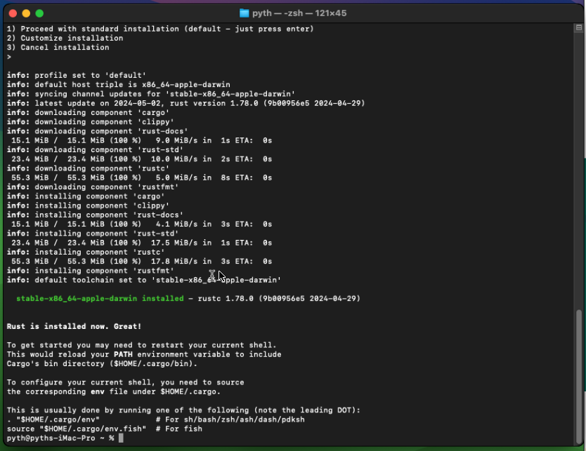
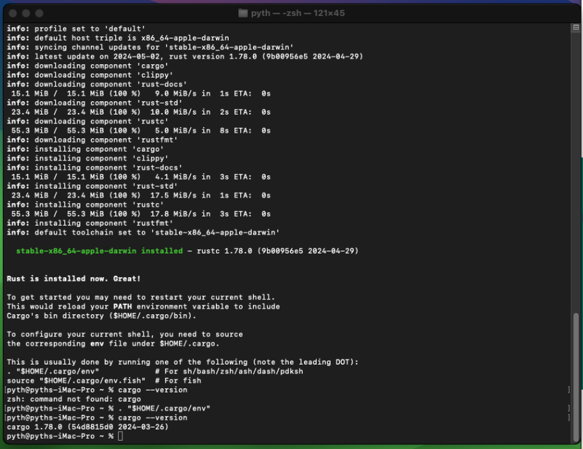
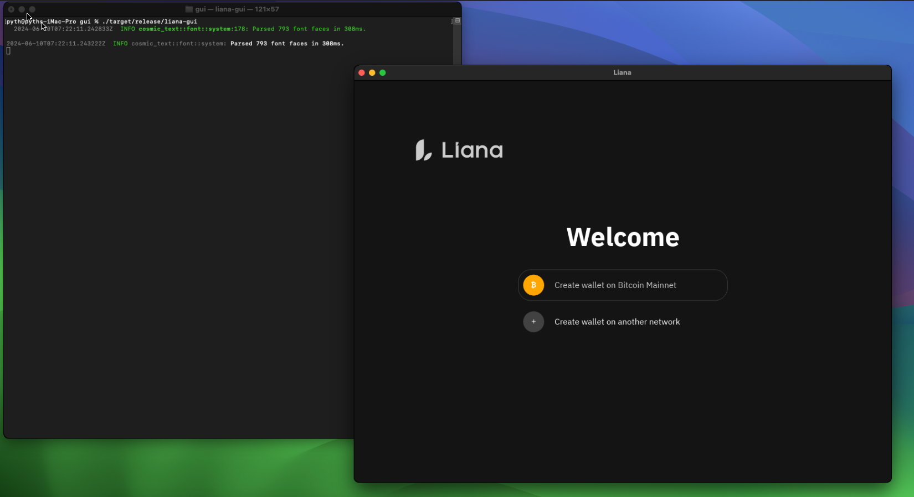

# Build Liana from sources on MacOS

## Rust toolchain

If  you visit [rust website](https://www.rust-lang.org/tools/install) you will find
the commands for install rust on your system:


You should open a terminal:


Copy the command into the terminal and hit enter:


Select `1) Proceed with standard installation` or press enter



Rust is now installed you can enter this command and check cargo is well installed:

```shell
. "$HOME/.cargo/env"
```

then

```shell 
cargo --version
```



## Liana source code

Download the liana repository (source code):

```shell 
git clone https://github.com/wizardsardine/liana.git
```

Note: if `git` is not yet installed on your system, you'll be prompted to accept to install it, 
then you should re-run the command for clone the Liana repository.


Then cd into the liana repository:

```shell 
cd liana/gui
```
and build Liana:


```shell
cargo build --release
```

if the prompt ends up with this you are good:


you can now run liana w/ this command:

```shell
./target/release/liana-gui
```



