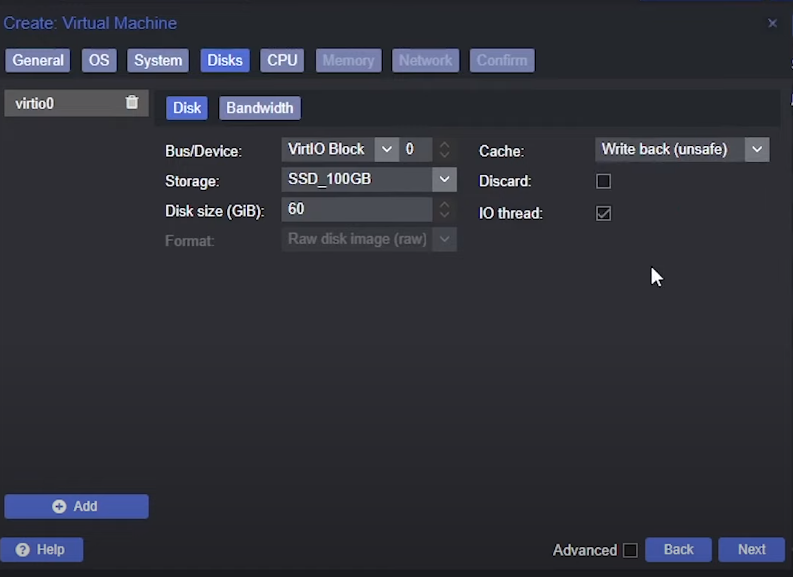
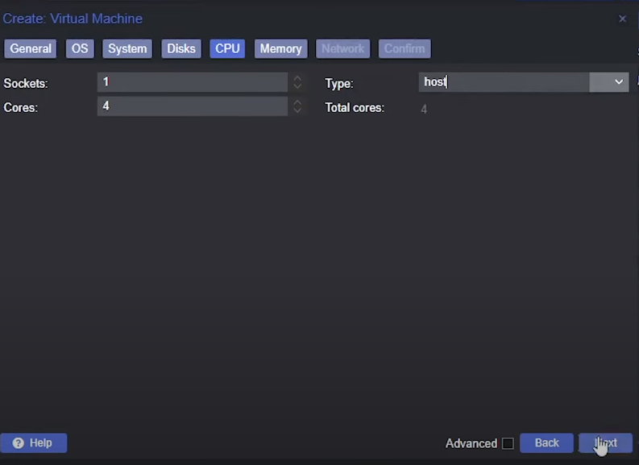

# MacOS Vm on Proxmox server

I agree it sucks that (too much) people use closed source secure-advertised-only (trust me bro) OSs, 
but in the end, we build software for users, so we have to make it work on the platform they use, and 
it means also testing properly on the platform they use.

## Proxmox

Proxmox is a Virtual Machine manager implementation, a minimal Debian OS with an admin interface to spawn VMs. 
This post will show you a step-by-step flow to build a MacOS VM for Proxmox.

## What you need

- A KVM-OpenCore *.iso image, you can get the latest [here](https://github.com/thenickdude/KVM-Opencore/releases/)
- A MacOS *.iso image
- An already running proxmox server, I'll assume here that you are familliar managing a Proxmox server.

You should first upload OpenCore and you MacOS image to your Proxmox Server.

## Install KVM-OpenCore

KVM OpenCore is a virtualized implementation of the OpenCore bootloader, typically used to run macOS on Linux-based 
systems via KVM (Kernel-based Virtual Machine). This setup enables users to create a macOS virtual machine with 
near-native performance, leveraging OpenCore to manage the macOS boot process in a virtual environment.

### General Tab


 - Choose a name for the VM.

 - The VM ID is not very important here, it should just be unique.

### OS Tab


 - Select the Opencore image you have previously installed
 - Set Guest OS type to `Other`

### System Tab


 - Graphic card: `VMware compatible`
 - Machine: `q35`
 - BIOS: `OVMF (UEFI)`
 - Check `Add EFI disk`
 - Select a storage
 - Uncheck `Pre-Enroll keys`
 - SCSI: `VirtIO SCSI`

### Disks Tab



 - Bus/Device: `VirtIO Block`
 - Disk Size: at least `60` GiB
 - Cache: `Write back (unsafe)`

### CPU Tab



 - Cores: at least `4`
 - Type: `host`

### Memory Tab


Memory: at least `8192` GiB

### Network tab


Model: `VMware vmxnet3`

Then create the VM

### Setup MacOS *.iso in drive


Select the created Vm => `Hardware` => `Add` => `CD/DVD Drive`


 - Storage: `ISOs`
 - ISO image: your macos *.iso image uploaded previously

### Configure VM via host terminal


 Click on your server name => `Shell`

then open the config file:

```shell 
nano /etc/pve/qemu-server/1400.conf
```
here you should replace `1400` by your VM Id.

then add this line on top of *.conf file:
```
args: -device isa-applesmc,osk="ourhardworkbythesewordsguardedpleasedontsteal(c)AppleComputerInc" -smbios type=2 -device qemu-xhci -device usb-kbd -device usb-tablet -global nec-usb-xhci.msi=off -global ICH9-LPC.acpi-pci-hotplug-with-bridge-support=off -cpu host,vendor=GenuineIntel,+invtsc,+hypervisor,kvm=on,vmware-cpuid-freq=on
```


on lines starting with `ide_` replace `media=cdrom` by `cache=unsafe`

### Install MacOS on the VM

Now start the VM.


Select `UEFI Shell` using arrows and enter.


Enter this cmmands to launch `boot.efi`

```shell
fs0:
```
```shell
System\Library\CoreServices\boot.efi
```


click `Disk utility` and `continue`


select the `VirtIO media block` then `Erase`


Choose a new name for the media and click `Erase`


Click `Done` and close utility.


Now click `Installl MacOS ...` & `Continue` Then follow the install process.


Select the disk you have previously erased (`MacOS` here) and continue the insatll process.


Several time during install process you'll have to select `macOS Installer` w/ arrow & enter

Follow the notmal macOS install process

### Let macOS boot w/o OpenCore
Open a terminal and:

```shell 
git clone https://github.com/corpnewt/MountEFI
cd MountEFI
chmod +x MountEFI.command
./MountEFI.command
```

if you are prompted to install git, do so and retry clone the repo.


you should now land there, enter `B` to mount the EFI, you'll be asked to enter your password.

then you should land here:


Download `OpenCoreEFIFolder-vxx.zip` from [the github repo](https://github.com/thenickdude/KVM-Opencore/releases/)

Unzip it and copy `EFI` folder to the root of the EFI partition

You can now stop the VM


Back to Proxmox admin panel, you should detach both *.iso images from the VM


Yout VM install is now finalized!

Some screenshots and the general flow comes from this [video](https://www.youtube.com/watch?v=68R2SdbFj-8)
