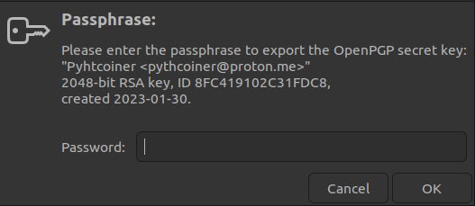
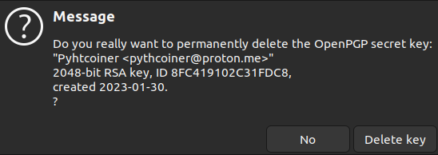

# PGP with your Ledger Nano S

Using PGP with your Ledger Nano S, a physical device that stores a user’s private keys, which are 
used to access their digital assets. Usually they are used for store private keys related to 
cryptocurrencies like Bitcoin, in this article, we will discuss the benefits of using a hardware 
wallet to store PGP private keys, and why it is a better option than software-based storage solutions. 
We will provide a step-by-step guide on how to set up and use a Ledger Nano S for storing PGP private 
keys, and will explain why this method of storage is essential for anyone looking to secure their key 
with an easy to use hardware solution.

## Install OpenPGP App on your Ledger Nano S

This article have been made under Ubuntu 22.04 LTS but might be reproducible with Ledger Nano S Plus 
and Ledger Nano X and with other Linux distro.

First you need to install OpenPGP App on your ledger:
 - Connect your Ledger Nano and input your PIN
 - Start Ledger Live
 - Go to settings

 

 - Go to experimental features and enable Developer Mode

 

 - Go to `My Ledger`
 - Install OPenPGP app

 

You can now start OpenPGP on your Ledger Hardware and follow the next steps.

## Install PGP smartcards tools

```shell
pythcoiner@pythcoiner:~$ sudo apt install scdaemon pcscd pcsc-tools
pythcoiner@pythcoiner:~$ sudo systemctl enable pcscd
pythcoiner@pythcoiner:~$ sudo systemctl restart pcscd
```

 - You can now launch OpenPGP app on your ledger Device
 - Check the connection with the Ledger Nano S:

 ```shell
pythcoiner@pythcoiner:~$ pcsc_scan -r
0: Ledger Nano S [Nano S] (0001) 00 00
```
 - Check the status

 ```shell
pythcoiner@pythcoiner:~$ gpg --card-status
Reader ...........: Ledger Nano S [Nano S] (0001) 00 00
Application ID ...: D2760001240103032C97EE1XXXX0000
Application type .: OpenPGP
Version ..........: 3.3
Manufacturer .....: unknown
Serial number ....: EE1XXXX6
Name of cardholder: [not set]
Language prefs ...: [not set]
Salutation .......: 
URL of public key : [not set]
Login data .......: [not set]
Signature PIN ....: not forced
Key attributes ...: rsa2048 rsa2048 rsa2048
Max. PIN lengths .: 12 12 12
PIN retry counter : 3 0 3
Signature counter : 0
Signature key ....: [none]
Encryption key....: [none]
Authentication key: [none]
General key info..: [none]
```

NOTE: If you got this issue:
```shell
pythcoiner@pythcoiner:~$ gpg --card-status
gpg: selecting card failed: No such device
gpg: OpenPGP card not available: No such dev
```

or this one:
```shell
pythcoiner@pythcoiner:~$ pcsc_scan -r
SCardEstablishContext: Service not available.
```

you can try to restart pcscd
```shell
pythcoiner@pythcoiner:~$ sudo systemctl restart pcscd
```

NOTE2:

Since gpg v2.4 you should add `disable-ccid` option in scdaemon.conf (https://dev.gnupg.org/T6871)

NOTE3:

I experienced an issue (Ubuntu Server 22.04) where Nano S were detected but not NANO SP (Nano S+)

Looking at [this issue](https://github.com/LedgerHQ/openpgp-card-app/issues/79) and 
[Ledger documentation](https://github.com/LedgerHQ/openpgp-card-app/blob/develop/doc/user/blue-app-openpgp-card.rst) 
i solve it by updating Ledger entries in /etc/libccid_Info.plist:

/etc/libccid_Info.plist details:
```
...

        <key>ifdVendorID</key>
        <array>

...

                <string>0x2C97</string>
                <string>0x2C97</string>
                <string>0x2C97</string>
                <string>0x2C97</string>
                <string>0x2C97</string>
                <string>0x2C97</string>

...

        </array>

        <key>ifdProductID</key>
        <array>

...

                <string>0x0001</string>
                <string>0x0004</string>
                <string>0x0005</string>
                <string>0x1009</string>
                <string>0x4009</string>
                <string>0x5009</string>

...

       </array>

        <key>ifdFriendlyName</key>
        <array>

...

                <string>Ledger Nano S</string>
                <string>Ledger Nano X</string>
                <string>Ledger Nano SP</string>
                <string>Ledger Nano S</string>
                <string>Ledger Nano X</string>
                <string>Ledger Nano S Plus</string>

...

    </array>

        <key>Copyright</key>

...
```

## Configure your ledger

 - You can edit the card data by this way:

```shell
pythcoiner@pythcoiner:~$ gpg --edit-card

Reader ...........: Ledger Nano S [Nano S] (0001) 00 00
Application ID ...: D2760001240103032C97EEXXXX0000
Application type .: OpenPGP
Version ..........: 3.3
Manufacturer .....: unknown
Serial number ....: EE1XXXX6
Name of cardholder: [not set]
Language prefs ...: [not set]
Salutation .......: 
URL of public key : [not set]
Login data .......: [not set]
Signature PIN ....: not forced
Key attributes ...: rsa2048 rsa2048 rsa2048
Max. PIN lengths .: 12 12 12
PIN retry counter : 3 0 3
Signature counter : 0
Signature key ....: [none]
Encryption key....: [none]
Authentication key: [none]
General key info..: [none]

gpg/card> admin
Admin commands are allowed
```
 - You can get the commands for edit:

 ```shell
gpg/card> help
quit           quit this menu
admin          show admin commands
help           show this help
list           list all available data
name           change card holder's name
url            change URL to retrieve key
fetch          fetch the key specified in the card URL
login          change the login name
lang           change the language preferences
salutation     change card holder's salutation
cafpr          change a CA fingerprint
forcesig       toggle the signature force PIN flag
generate       generate new keys
passwd         menu to change or unblock the PIN
verify         verify the PIN and list all data
unblock        unblock the PIN using a Reset Code
factory-reset  destroy all keys and data
kdf-setup      setup KDF for PIN authentication
key-attr       change the key attribute
```

 - There is 2 pin access level, user(123456) and admin(12345678) lets first change its for obvious safety reasons:

 ```shell 
gpg/card> passwd
gpg: OpenPGP card no. D27600XXXXXXXX032C97EE1XXXXX0000 detected

1 - change PIN
2 - unblock PIN
3 - change Admin PIN
4 - set the Reset Code
Q - quit

Your selection? 1
```

 - Then fill in the old user password(123456) and choose a new one


 


 - You can do the same for admin pin:

 ```shell
1 - change PIN
2 - unblock PIN
3 - change Admin PIN
4 - set the Reset Code
Q - quit

Your selection? 3
```

 - Then you can change the name:

```shell
gpg/card> name
Cardholder's surname: maximalist
Cardholder's given name: Pythcoiner

gpg/card> list

Reader ...........: Ledger Nano S [Nano S] (0001) 00 00
Application ID ...: D2760001240103032C97EE1XXXXX0000
Application type .: OpenPGP
Version ..........: 3.3
Manufacturer .....: unknown
Serial number ....: EE1XXXX6
Name of cardholder: Pythcoiner maximalist
Language prefs ...: [not set]
Salutation .......: 
URL of public key : [not set]
Login data .......: [not set]
Signature PIN ....: not forced
Key attributes ...: rsa2048 rsa2048 rsa2048
Max. PIN lengths .: 12 12 12
PIN retry counter : 3 0 3
Signature counter : 0
Signature key ....: [none]
Encryption key....: [none]
Authentication key: [none]
General key info..: [none]

gpg/card> quit
pythcoiner@pythcoiner:~$
```

## Generate your PGP primary key and subkeys

For security reasons it is better to generate and keep you secret keys backup from a server not 
connected to the internet, and then only import the pubkeys on laptop you using on daily basis.

 - It’s now time to generate your primary key from your secret server:

 ```shell 
pythcoiner@pythcoiner:~$ gpg --quick-gen-key 'Pyhtcoiner <pythcoiner@proton.me>' rsa2048 cert 0y
We need to generate a lot of random bytes. It is a good idea to perform
some other action (type on the keyboard, move the mouse, utilize the
disks) during the prime generation; this gives the random number
generator a better chance to gain enough entropy.
```

 - Then you might to enter a passphrase:


```shell 
gpg: revocation certificate stored as '/home/pythcoiner/.gnupg/openpgp-revocs.d/EB2FCD69E87A45A382E24E1A8FC419102C31FDC8.rev'
public and secret key created and signed.

Note that this key cannot be used for encryption.  You may want to use
the command "--edit-key" to generate a subkey for this purpose.
pub   rsa2048 2023-01-30 [C]
      EB2FCD69E87A45A382E24E1A8FC419102C31FDC8
uid                      Pyhtcoiner <pythcoiner@pyth.dev>
```
 - You can list your keys:

 ```shell 
pythcoiner@pythcoiner:~$ gpg -k
/home/pythcoiner/.gnupg/pubring.kbx
----------------------------
pub   rsa2048 2023-01-30 [C]
      EB2FCD69E87A45A382E24E1A8FC419102C31FDC8
uid           [ultimate] Pyhtcoiner <pythcoiner@proton.me>
```

This primary key have the certification function only, we need to generate subkeys with sign and 
encrypt functions:

 - First generate the sign key, you might replace the pubkey (EB2FCD69E87A45A382E24E1A8FC419102C31FDC8) 
 by yours:

 ```shell 
pythcoiner@pythcoiner:~$ gpg --quick-addkey EB2FCD69E87A45A382E24E1A8FC419102C31FDC8 rsa2048 sign 0y
```

Enter your passphrase:


```shell
We need to generate a lot of random bytes. It is a good idea to perform
some other action (type on the keyboard, move the mouse, utilize the
disks) during the prime generation; this gives the random number
generator a better chance to gain enough entropy.
```

 - Then generate encryption key, you might replace the pubkey (EB2FCD69E87A45A382E24E1A8FC419102C31FDC8) 
 by yours:

 ```shell 
pythcoiner@pythcoiner:~$ gpg --quick-addkey EB2FCD69E87A45A382E24E1A8FC419102C31FDC8 rsa2048 encr 0y
```

Enter your passphrase:


```shell
We need to generate a lot of random bytes. It is a good idea to perform
some other action (type on the keyboard, move the mouse, utilize the
disks) during the prime generation; this gives the random number
generator a better chance to gain enough entropy.
```

## Backup your keys

This is a the most important part, you might to backup the keys to a safe place (a server not connected 
to the internet , ideally you generate the keys from this server and load it to your Ledger Nano, then 
only export the public key to the laptop you will use on daily basis) to recover them in case of loss 
or failure of your hardware device.

 - First backup the master key:

 ```shell
pythcoiner@pythcoiner:~/.gpg_backup$ gpg -a --export-secret-keys pythcoiner@proton.me > secret_keys.gpg
```

Enter your passphrase



 - Then backup subkeys:

 ```shell
pythcoiner@pythcoiner:~/.gpg_backup$ gpg -a --export-secret-subkeys pythcoiner@proton.me > secret_subkeys.gpg
```

Enter your passphrase again


Finally export your pubkey:

```shell
pythcoiner@pythcoiner:~/.gpg_backup$ gpg -a --export pythcoiner@proton.me > pubkey.gpg
```

## Load your keys to your Ledger

 - First go to the edit menu:

 ```shell
pythcoiner@pythcoiner:~$ gpg --edit-key pythcoiner@proton.me
gpg (GnuPG) 2.2.35; Copyright (C) 2022 g10 Code GmbH
This is free software: you are free to change and redistribute it.
There is NO WARRANTY, to the extent permitted by law.

Secret key is available.

sec  rsa2048/8FC419102C31FDC8
     created: 2023-01-30  expires: never       usage: C   
     trust: unknown       validity: unknown
ssb  rsa2048/6D8FEF95C7869709
     created: 2023-01-30  expires: never       usage: S   
ssb  rsa2048/8D7887D25E242C88
     created: 2023-01-30  expires: never       usage: E   
[ unknown] (1). Pyhtcoiner <pythcoiner@proton.me>
```

 - Select the first subkey:

 ```shell
gpg> key 1

sec  rsa2048/8FC419102C31FDC8
     created: 2023-01-30  expires: never       usage: C   
     trust: unknown       validity: unknown
ssb* rsa2048/6D8FEF95C7869709
     created: 2023-01-30  expires: never       usage: S   
ssb  rsa2048/8D7887D25E242C88
     created: 2023-01-30  expires: never       usage: E   
[ unknown] (1). Pyhtcoiner <pythcoiner@proton.me>
```

 - Load into SmartCard:

 ```shell
gpg> keytocard
Please select where to store the key:
   (1) Signature key
   (3) Authentication key
Your selection? 1
```

Enter you passphrase


```shell
sec  rsa2048/8FC419102C31FDC8
     created: 2023-01-30  expires: never       usage: C   
     trust: unknown       validity: unknown
ssb* rsa2048/6D8FEF95C7869709
     created: 2023-01-30  expires: never       usage: S   
ssb  rsa2048/8D7887D25E242C88
     created: 2023-01-30  expires: never       usage: E   
[ unknown] (1). Pyhtcoiner <pythcoiner@proton.me>
```

 - Unselect first subkey

 ```shell
gpg> key 1

sec  rsa2048/8FC419102C31FDC8
     created: 2023-01-30  expires: never       usage: C   
     trust: unknown       validity: unknown
ssb  rsa2048/6D8FEF95C7869709
     created: 2023-01-30  expires: never       usage: S   
ssb  rsa2048/8D7887D25E242C88
     created: 2023-01-30  expires: never       usage: E   
[ unknown] (1). Pyhtcoiner <pythcoiner@proton.me>
```

 - Select second subkey

 ```shell
gpg> key 2

sec  rsa2048/8FC419102C31FDC8
     created: 2023-01-30  expires: never       usage: C   
     trust: unknown       validity: unknown
ssb  rsa2048/6D8FEF95C7869709
     created: 2023-01-30  expires: never       usage: S   
ssb* rsa2048/8D7887D25E242C88
     created: 2023-01-30  expires: never       usage: E   
[ unknown] (1). Pyhtcoiner <pythcoiner@proton.me>
```

- Load into SmartCard:

```shell
gpg> keytocard
Please select where to store the key:
   (2) Encryption key
Your selection? 2
```

 - Enter passphrase


 - then save

 ```shell
gpg> save
```

If you have generate your keys from your laptop or an unsecured pc, you might to transfer the 
backup to the secure location then delete the secret keys from your unsecured device:

```shell
pythcoiner@pythcoiner:~$ gpg --delete-secret-key pythcoiner@pyth.dev
gpg (GnuPG) 2.2.35; Copyright (C) 2022 g10 Code GmbH
This is free software: you are free to change and redistribute it.
There is NO WARRANTY, to the extent permitted by law.


sec  rsa2048/8FC419102C31FDC8 2023-01-30 Pyhtcoiner <pythcoiner@pyth.dev>

Delete this key from the keyring? (y/N) y
This is a secret key! - really delete? (y/N) y
```

Then valid on the pop-up window



## Import PGP Pubkey on your laptop

 - First move the backup of your public key and import it:

 ```shell
pythcoiner@pythcoiner:~$ gpg --import pubkey.gpg 
gpg: key 8FC419102C31FDC8: public key "Pyhtcoiner <pythcoiner@proton.me>" imported
gpg: Total number processed: 1
gpg:               imported: 1
```

 - Fetch your card data:

 ```shell
pythcoiner@pythcoiner:~$ gpg --card-edit
gpg/card> fetch
gpg/card> quit
```

 - Then trust your key:

 ```shell
pythcoiner@pythcoiner:~$ gpg --edit-key pythcoiner@pyth.dev
gpg (GnuPG) 2.2.35; Copyright (C) 2022 g10 Code GmbH
This is free software: you are free to change and redistribute it.
There is NO WARRANTY, to the extent permitted by law.

Secret subkeys are available.

pub  rsa2048/8FC419102C31FDC8
     created: 2023-01-30  expires: never       usage: C   
     trust: unknown       validity: unknown
ssb  rsa2048/6D8FEF95C7869709
     created: 2023-01-30  expires: never       usage: S   
     card-no: 2C97 EE1XXXX6
ssb  rsa2048/8D7887D25E242C88
     created: 2023-01-30  expires: never       usage: E   
     card-no: 2C97 EE1XXXX6
[ unknown] (1). Pyhtcoiner <pythcoiner@pyth.dev>

gpg> trust
pub  rsa2048/8FC419102C31FDC8
     created: 2023-01-30  expires: never       usage: C   
     trust: unknown       validity: unknown
ssb  rsa2048/6D8FEF95C7869709
     created: 2023-01-30  expires: never       usage: S   
     card-no: 2C97 EE1XXXX6
ssb  rsa2048/8D7887D25E242C88
     created: 2023-01-30  expires: never       usage: E   
     card-no: 2C97 EE1XXXX6
[ unknown] (1). Pyhtcoiner <pythcoiner@pyth.dev>

Please decide how far you trust this user to correctly verify other users' keys
(by looking at passports, checking fingerprints from different sources, etc.)

  1 = I don't know or won't say
  2 = I do NOT trust
  3 = I trust marginally
  4 = I trust fully
  5 = I trust ultimately
  m = back to the main menu

Your decision? 5
Do you really want to set this key to ultimate trust? (y/N) y

pub  rsa2048/8FC419102C31FDC8
     created: 2023-01-30  expires: never       usage: C   
     trust: ultimate      validity: unknown
ssb  rsa2048/6D8FEF95C7869709
     created: 2023-01-30  expires: never       usage: S   
     card-no: 2C97 EE1XXXX6
ssb  rsa2048/8D7887D25E242C88
     created: 2023-01-30  expires: never       usage: E   
     card-no: 2C97 EE1XXXX6
[ unknown] (1). Pyhtcoiner <pythcoiner@pyth.dev>
Please note that the shown key validity is not necessarily correct
unless you restart the program.

gpg> quit
```

- You can now try to sign a file with GPG and your key stored on your Ledger Nano S:

```shell 
pythcoiner@pythcoiner:~$ gpg --detach-sign file.txt
```

 - This window might pop-up and ask you unlock the card 


 - Now deconnect your Ledger Nano S from your laptop, then retry sign:

 ```shell
pythcoiner@pythcoiner:~$ gpg --detach-sign file.txt
```

This window might pop up and signature fail


You now know how touse pgp with your ledger, then you can learn how to use a password Manager with PGP!

This article have been made with help of this sources:

 - Using your Ledger Nano to authenticate you SSH connections | Ledger Blog [link](https://dud225.github.io/LedgerHQ.github.io/ssh-with-openpgp-card-app/)
 - GPG : comment créer une paire de clefs presque parfaite [link](https://www.nextinpact.com/article/25351/102685-gpg-comment-creer-paire-clefs-presque-parfaite)
 - Clefs GPG : comment les stocker et les utiliser via une clef USB OpenPGP Card ? [link](https://www.nextinpact.com/article/25468/102201-clefs-gpg-comment-stocker-et-utiliser-via-clef-usb-openpgp-card)


