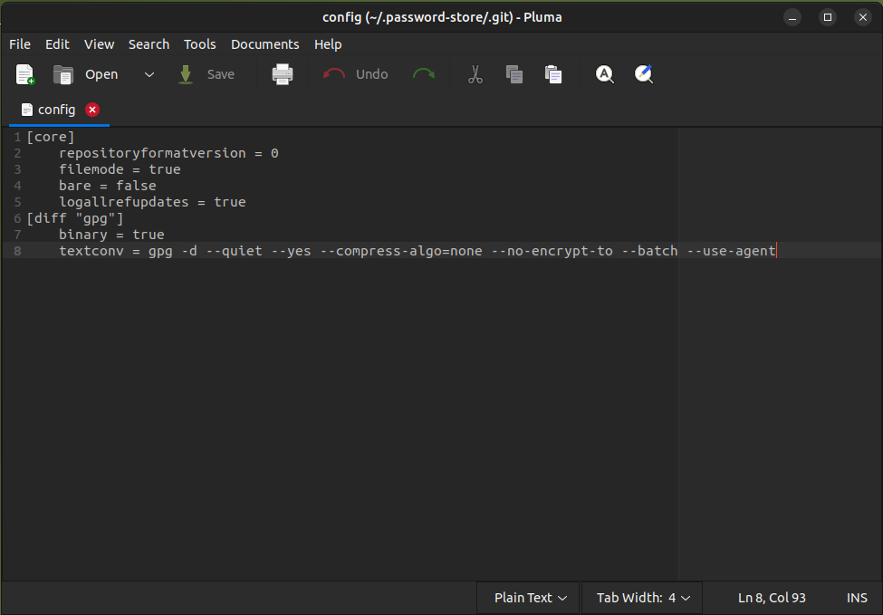
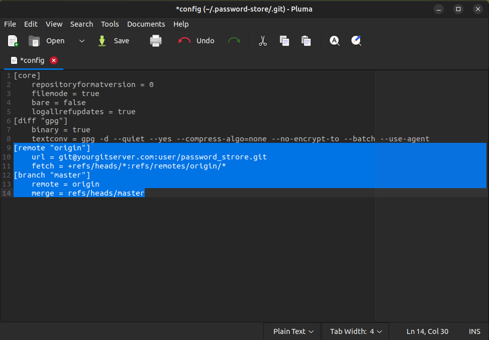
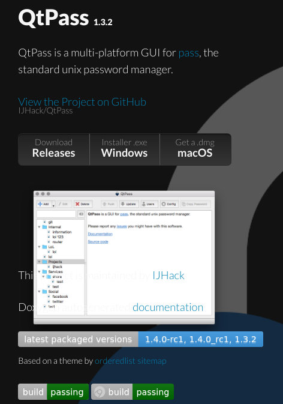
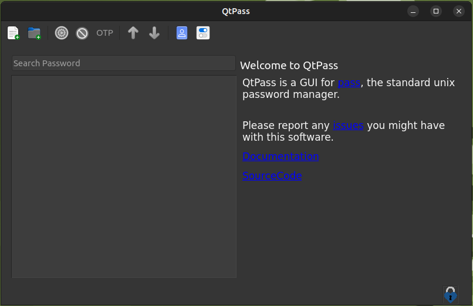
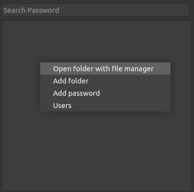
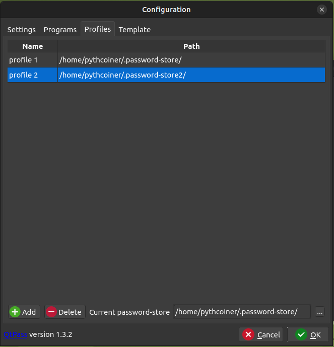
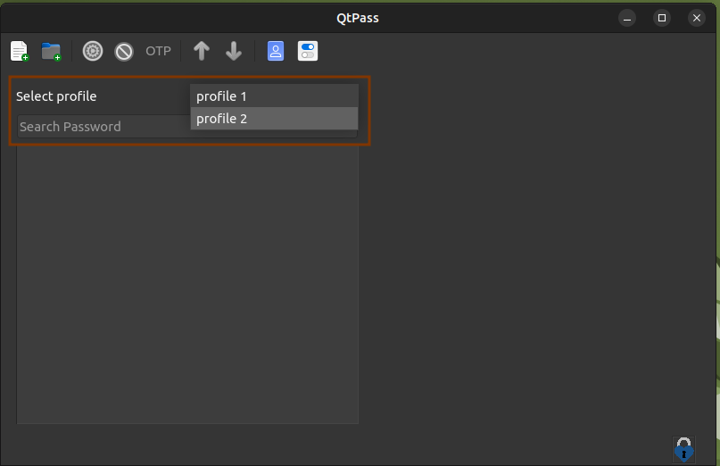

# Using your password manager with PGP

## Why use a password manager with PGP?

Managing multiple today can be a daunting task, especially with the increasing number of online accounts. 
It is challenging to remember all these passwords, and this is where password managers come in handy. 
Your password managerwith PGP securely stores all your passwords in one location. It allow you to access 
them easily . This makes it much easier and more convenient to manage your online accounts, while also 
enhancing your security.

However, if you simply store your passwords directly in a browser is not a safe method of password 
management. Browsers are vulnerable to various security threats, such as malware, phishing attacks, and 
hacking. If a hacker gains access to your computer, they can easily retrieve your stored passwords, 
putting your online accounts at risk of being compromised. This can lead to identity theft and financial 
loss. In addition, if your computer is lost or stolen, your passwords are easily accessible to whoever got it.

## How to improve?

This is where PGP (Pretty Good Privacy) encryption comes in. PGP is a widely used encryption standard for 
secure communication and data storage. By combining the use of a password manager with PGP encryption, you 
can ensure that your passwords are protected against unauthorized access. In the last article, we dig into 
how to use PGP encryption and store the keys on an Ledger Nano Hardware Wallet. Now we will take it a step 
further by using an password manager with the previous setup. We will add an additional layer of security 
as it ensures that even if your computer is compromised, the password are still safe, your passwords cannot 
be decrypted without physical access to the hardware device.


Whether you are new to password managers or simply looking to upgrade your security, we will provide you 
with all the information you need to get started with PGP-secured password management using hardware 
storage. By following these steps, you can rest assured that your passwords are safe and secure.

We made this article under Ubuntu 22.04 LTS but might be reproducible with other Linux distro.

## Using PASS

PASS is a standard Unix password manager that is used to securely store passwords, secrets, and other 
sensitive information. It ‘s open-source software, which means that anyone can check the source code. 
PASS is a password manager with PGP encryption to ensure that all stored information is secure and can 
only be accessed with a passphrase. Pass used Git for remote backups. The software is easy to use and offers 
a simple command-line interface that makes it easy to manage passwords . You can learn more 
about PASS [here](https://www.passwordstore.org/).


## Why Choosing PASS

 - Open Source: Pass is an Open Source project, followed by a huge community.
 - Stable project: First Pass release from 2012, actively maintained.
 - Migration tools: A bunch of migration tools are available for migrate from many other password managers.
 - Cross-Platform: Pass is available on all the main platforms, Linux, MAC, Windows.
 - Unix Philosophy: Pass follow the Keep It Simple paradigm.
 - GUI Client: Many GUI client available for all desktop and mobile platforms.


## Install PASS

Prior to install pass, you might have git installed:
```shell
pythcoiner@pythcoiner:~$ sudo apt install -y git
```

Then you can install pass:
```shell
pythcoiner@pythcoiner:~$ sudo apt install -y p
```
## Configure PASS

Prior to configure pass, you need to get your PGP pubkey:
```shell
pythcoiner@pythcoiner:~$ gpg -K
/home/pythcoiner/.gnupg/pubring.kbx
-----------------------------------
sec   rsa2048 2023-02-05 [C]
      37833B5FC36137944ACCF1FD89197BAEF074F4F2
uid           [ultimate] Pythcoiner <pythcoiner@proton.me>
ssb   rsa2048 2023-02-05 [S]
ssb   rsa2048 2023-02-05 [E]
```

Now you can initialize pass:

```shell
pythcoiner@pythcoiner:~$ pass init "37833B5FC36137944ACCF1FD89197BAEF074F4F2"
mkdir: created directory '/home/pythcoiner/.password-store/'
Password store initialized for 37833B5FC36137944ACCF1FD89197BAEF074F4F
```

pass as made a new directory for store our encrypted password at /home/pythcoiner/.password-store/

Lets have a look there

```shell
pythcoiner@pythcoiner:~$ cd  /home/pythcoiner/.password-store/
pythcoiner@pythcoiner:~/.password-store$ ls -a
.  ..  .gpg-id
pythcoiner@pythcoiner:~/.password-store$ cat .gpg-id 
37833B5FC36137944ACCF1FD89197BAEF074F4F2
pythcoiner@pythcoiner:~/.password-store$ 
```

We can now init the git repo if you plan to use the remote backup function:

First of all if you not yet configure git , define name and email that will be supplied on git commits:

```shell
pythcoiner@pythcoiner:~$ git config --global user.email "pythcoiner@pyth.dev"
pythcoiner@pythcoiner:~$ git config --global user.name "pythcoiner"
```
Then init the git repo with pass
```shell
pythcoiner@pythcoiner:~/.password-store$ pass git init
hint: Using 'master' as the name for the initial branch. This default branch name
hint: is subject to change. To configure the initial branch name to use in all
hint: of your new repositories, which will suppress this warning, call:
hint: 
hint: 	git config --global init.defaultBranch <name>
hint: 
hint: Names commonly chosen instead of 'master' are 'main', 'trunk' and
hint: 'development'. The just-created branch can be renamed via this command:
hint: 
hint: 	git branch -m <name>
Initialized empty Git repository in /home/pythcoiner/.password-store/.git/
[master (root-commit) 9145223] Add current contents of password store.
 2 files changed, 2 insertions(+)
 create mode 100644 .gitattributes
 create mode 100644 .gpg-id
pythcoiner@pythcoiner:~/.password-store$ 
```

Now edit git repo config file at ~/.password-store/.git/config:



and add remote server data:



## Using QtPass as Graphical User Interface for PASS:

We will now show you how to use pass with QtPass GUI Client, QtPass is a cross-platform client, 
have a simple GUI interface and can handle several profiles using different pubkeys, with that, 
you can easily manage both your private and professional passwords with the same tool! You can 
learn more about QtPass [here](https://qtpass.org/).



First of all lets install QtPass:
```shell
pythcoiner@pythcoiner:~/.password-store/.git$ sudo apt install -y qtpass
```

Then you can run QtPass by using this command:
```shell
pythcoiner@pythcoiner:~/.password-store/.git$ qtpass
```



You can now use the right click or the GUI buttons for add folders or passwords (each password is 
stored in a separate encrypted file)




You can also set several profiles (each profile can use a different pubkey. Then just need to copy 
the empty initial .password-store/ folder then edit ./git/config and .pgp-id files for fill your new 
git server backup location and new pubkey!o




It is then quite easy to switch between profiles:





